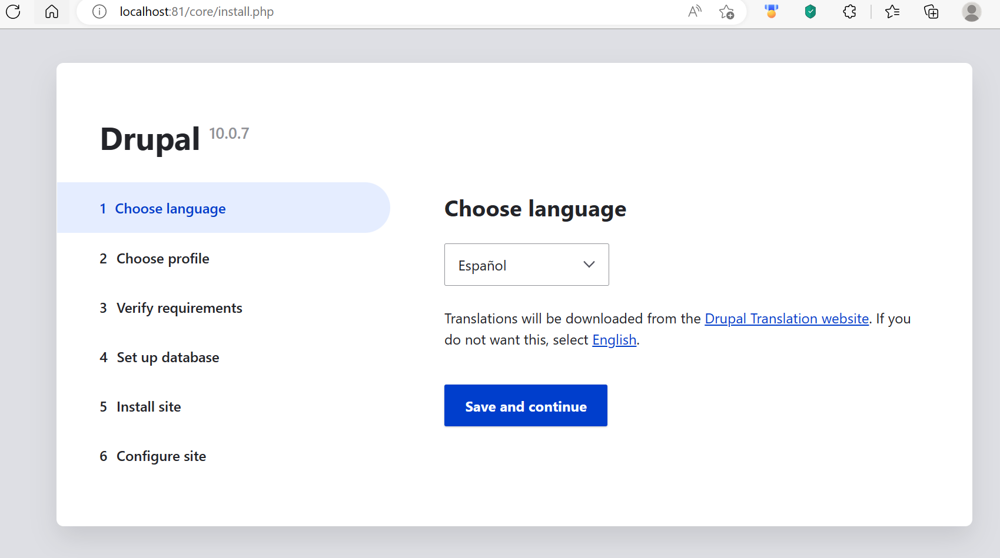
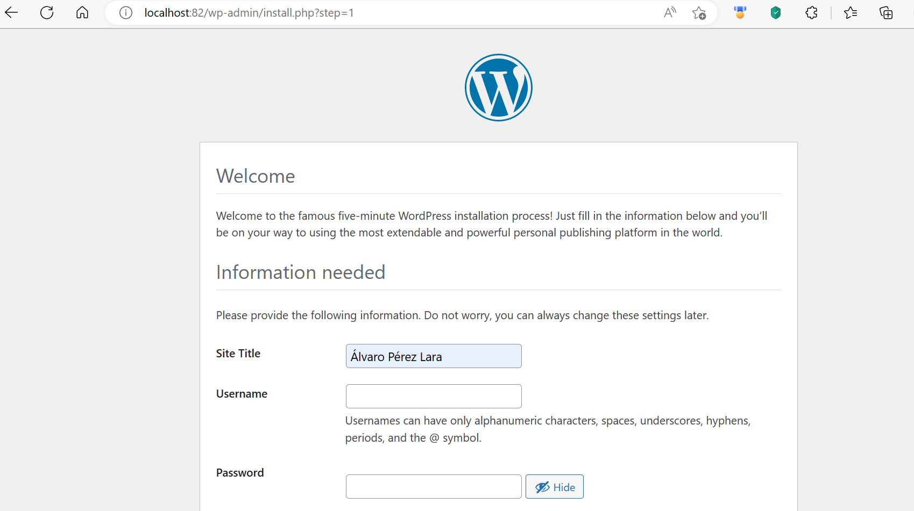

### Parte 1

Lo primero que hacemos en el fichero docker-compose es especificar los servicios, uno será drupal y el otro de base de datos, en cada uno de ellos especificamos una imagen a usar. En ambos tenemos uqe especificar dónde montar el volumen y el puerto que vaya a utilizar drupal. Tras ello podemos especificar varios parámetros de la base de datos en el campo *enviroment* y por último necesitamos que indicar que el servicio drupal depende de la base de datos porque éste necesita de una MySQL para funcionar correctamente, ésto lo haremos indicando el nombre del otro servicio en el campo *depends_on*, esto significa que el primer servicio en ser lanzado será la base de datos.

### Parte 2

Los pasos a seguir van a ser parecidos. De nuevo especificamos los dos servicios y la imagen que van a usar, wordpress usará el puerto 82 y dependerá del otro servicio, lo que significa que será lanzado después de la base de datos. Ambos servicios necesitan de varias especificaciones del entorno, en el campo *enviroment*, como es la contraseña entre otras. La red la especificamos tanto en wordpress como en MariaDB en el campo *network*.

